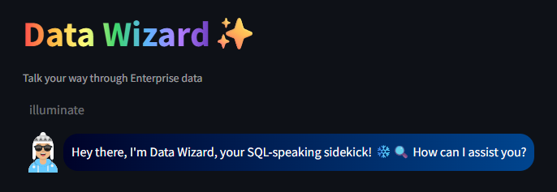
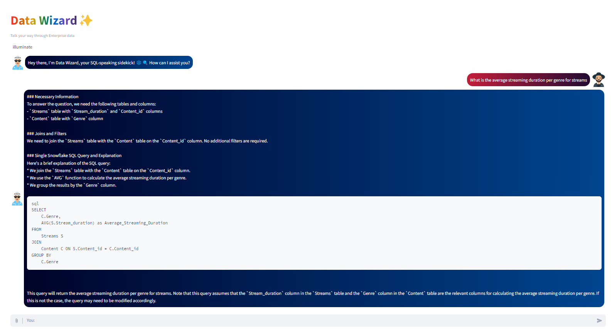
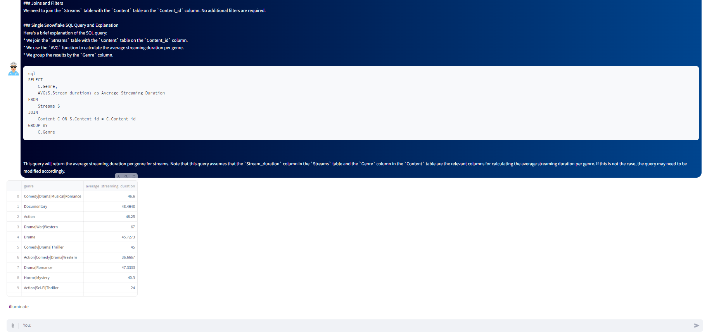
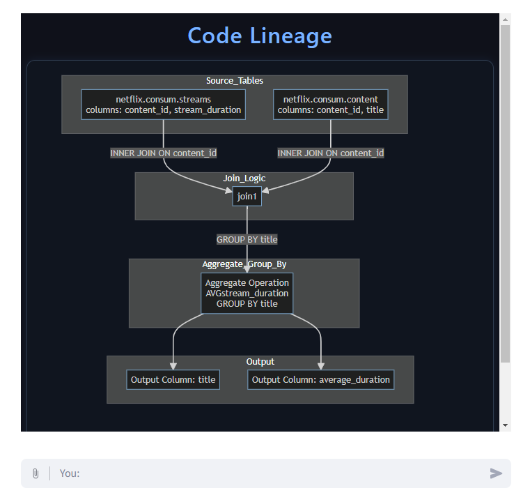
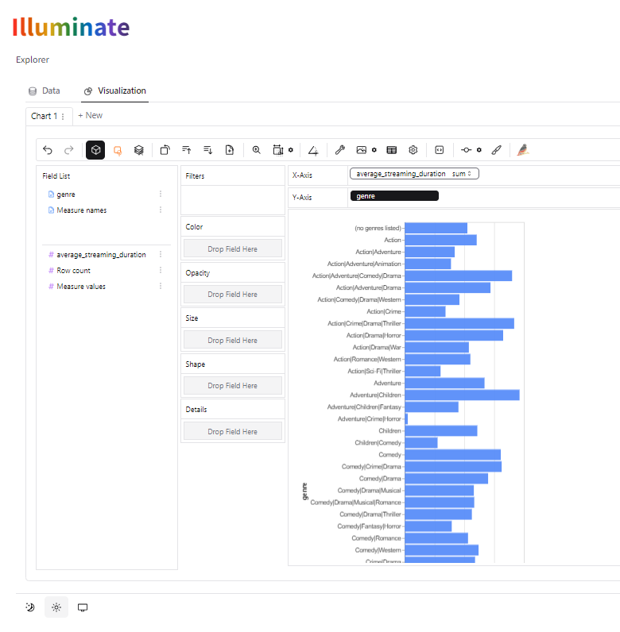
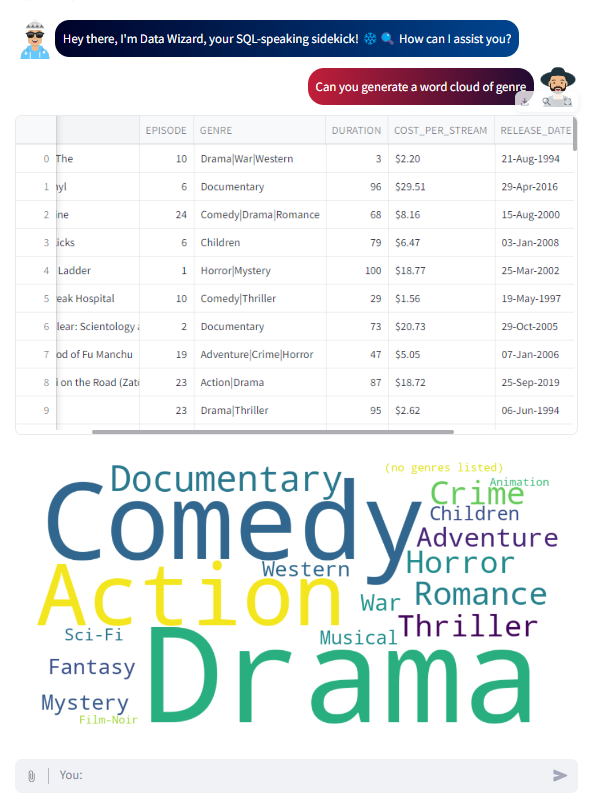

# Generative AI in Data Warehouse - DataWizard

An enterprise-style analytics workbench that turns natural language into trusted data insights through Graph-RAG-powered SQL generation, visual code lineage, and conversational CSV analysis. Designed to improve both query accuracy and user trust, the platform unifies structured database querying, explainable AI, and no-code analytics in a single experience.

  
  
  
  
  

---

## Overview

Data teams often face a familiar problem: business users need fast answers, but enterprise data platforms still depend heavily on SQL expertise. This project addresses that gap by building a unified AI-driven analytics layer that can understand natural language questions, generate SQL with richer schema context, explain the resulting logic visually, and support ad-hoc file analysis without requiring code.

Rather than treating Text-to-SQL as a standalone generation problem, this system approaches it as an end-to-end analytics workflow. It combines semantic retrieval, SQL generation, lineage transparency, and interactive exploration so users can move from question to validated insight with greater confidence. 

---

---

## What Makes It Different

Most Text-to-SQL systems focus only on generating syntactically valid SQL. This project goes further by improving semantic accuracy through concept-level Graph-RAG retrieval and by making the generated logic auditable through Mermaid-based lineage visualization. 

The result is a more production-oriented workflow that not only answers questions, but also helps users understand how the answer was derived. That combination of accuracy, transparency, and usability is central to the system’s design. 

---

## Core Capabilities

- Translate natural language questions into executable SQL for structured datasets. 
- Retrieve richer schema context using a Graph-RAG knowledge layer built around data concepts and relationships.
- Generate visual SQL lineage diagrams to make transformations traceable and easier to validate. 
- Support conversational analytics on uploaded CSV files without requiring a database connection. 
- Enable no-code visual exploration of query results and local datasets through an interactive analytics layer. 
- Deliver all of the above through a single Streamlit-based workbench. 

---
 

 

## Architecture

The platform follows a dual-pathway architecture that supports both database-centric analytics and file-based exploration. A central query router inspects the incoming request and sends it either to the Graph-RAG SQL pipeline or to the CSV analytics pipeline. [file:1]

### 1. Natural Language to SQL path

- User enters a business question in plain English. 
- The system retrieves relevant schema context from an enriched Graph-RAG knowledge base.
- A large language model generates SQL using that contextual metadata. 
- The generated query is executed against the target database. 
- A lineage engine parses the SQL and converts it into Mermaid syntax for visualization. 
- SQL, output data, and lineage are displayed together in the interface. 

### 2. CSV analytics path

- User uploads a CSV file for local analysis. 
- The query router directs the file to the dataframe analysis engine. 
- A conversational analytics component interprets prompts and performs transformations over the dataset.
- Results are returned as data views, explanations, or visual outputs. 
- The visualization layer enables drag-and-drop style exploration for deeper analysis. 

---
 

## System Components

| Component | Responsibility |
|----------|----------------|
| Streamlit UI | Provides the interactive application layer for inputs, outputs, and analytics views. |
| Query Router | Routes user requests to the appropriate processing pipeline.  |
| Graph-RAG Knowledge Layer | Supplies semantically enriched schema context for SQL generation.  |
| LLM SQL Generator | Produces executable SQL from natural language prompts.  |
| Lineage Engine | Converts generated SQL into column-level visual data flow diagrams.  |
| CSV Analytics Engine | Supports conversational analysis over uploaded tabular files.  |
| Visualization Layer | Enables no-code exploration using interactive charting and data views.  |

---

## Why Graph-RAG

Flat metadata is often not enough for enterprise-grade query generation. In many real-world schemas, correct SQL depends on understanding business meaning, relationship paths, and context-specific logic rather than simply matching column names.

This project improves retrieval by grouping related tables into concept-level metadata structures with richer descriptions and relational cues. That design reduces ambiguity and helps the model generate more accurate joins, filters, and aggregations for complex analytical questions.

---

## Explainability by Design

Trust is a major adoption barrier for AI-generated SQL. Even when a query appears correct, users still need visibility into how source tables, joins, and transformations contribute to the final output.

To address that, the system includes an automated code lineage engine that transforms SQL into Mermaid-based diagrams. This gives users a transparent, column-level view of the query flow, making the output easier to validate, debug, and audit. 

---

## Technology Stack

- Python 3.9 
- Streamlit 
- LangChain 
- Snowflake Connector 
- Sentence Transformers 
- Mermaid.js 
- pandas / pandas-ai 
- PyGWalker 
- Vector retrieval infrastructure for metadata indexing 

---

## Evaluation Highlights

The project compares a traditional metadata approach with an enriched knowledge-base design for SQL generation quality. The evaluation shows that the enriched Graph-RAG configuration improved required-data matching across complex test cases and delivered stronger semantic accuracy than the baseline approach.

The findings reinforce a key design principle: 
- Hypothesis Confirmed: An Enriched Knowledge Base is proven to significantly boost Text-to-SQL accuracy and reliability.

- Transparency Enables Trust: Automated code lineage provides critical auditability, which is essential for enterprise adoption.

- Unified Workbench Adds Value: The integrated solution effectively bridges the gap between user intent and complex data retrieval.

---

## Example Use Cases

- Business users asking plain-English questions against enterprise datasets. 
- Analysts validating AI-generated SQL before sharing results downstream. 
- Teams exploring local CSV files conversationally without writing Python or SQL. 
- Users building quick visuals from returned results using a no-code exploration layer. 

---

## Roadmap

- Dynamic metadata enrichment from business glossaries and query history. 
- Interactive ambiguity resolution for unclear user intent. 
- More cost-aware and execution-efficient SQL generation. 
- Human-in-the-loop feedback for continuous quality improvement. 

---

## Impact

This project demonstrates how AI-assisted analytics can be made more useful in enterprise settings by combining accuracy, transparency, and interactivity. Instead of generating SQL as an isolated artifact, it creates a more complete workflow where users can ask, inspect, validate, and explore within one system.

---

## Contribute and Extend

This project is open for contributions and experimentation. Developers, researchers, and data professionals are welcome to improve SQL generation, lineage visualization, interactive analytics, and overall system reliability.

New ideas, feature extensions, and performance improvements are encouraged.

---

## Author

**Ganesh Rohan**  
Data Engineer
Bengaluru, India

GitHub: [@ganeshrohan](https://github.com/ganeshrohan)
